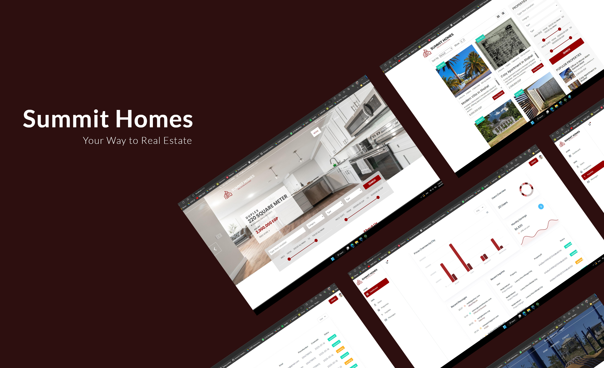
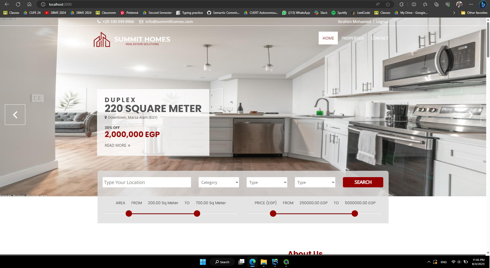
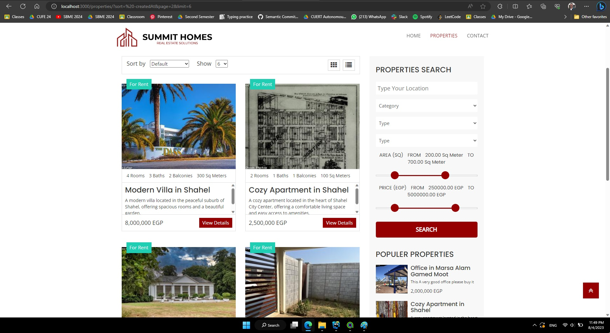
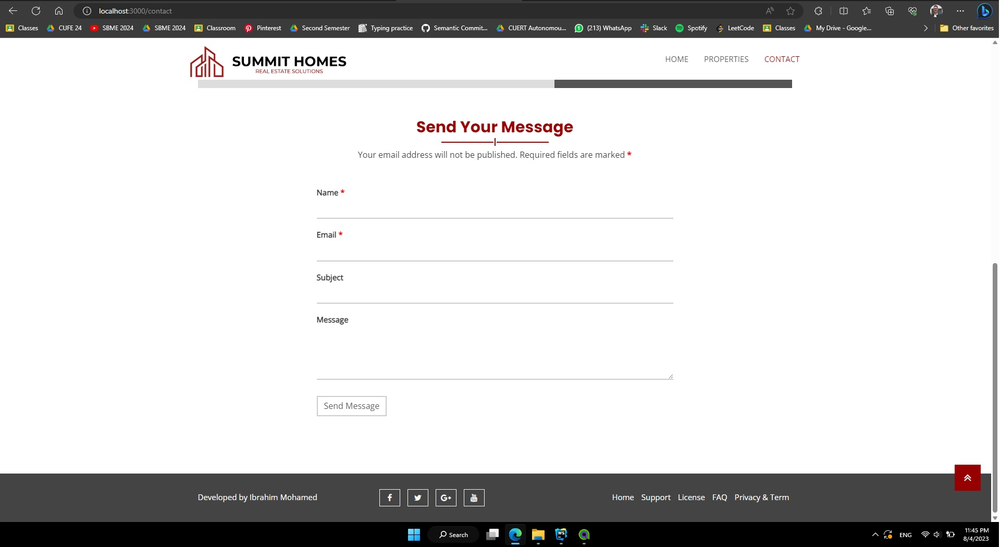
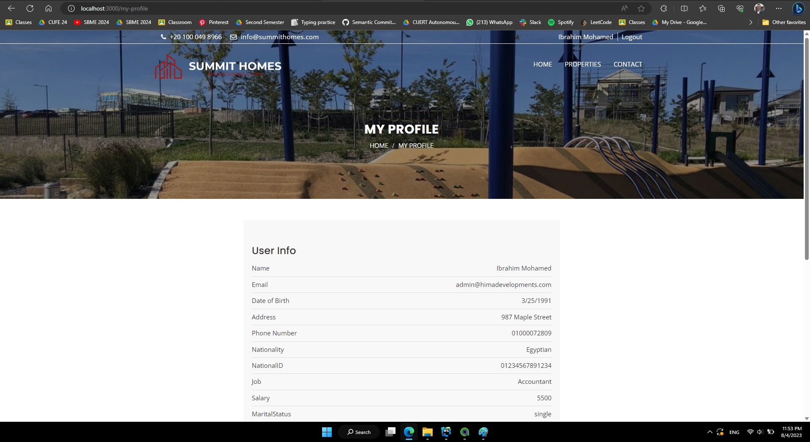
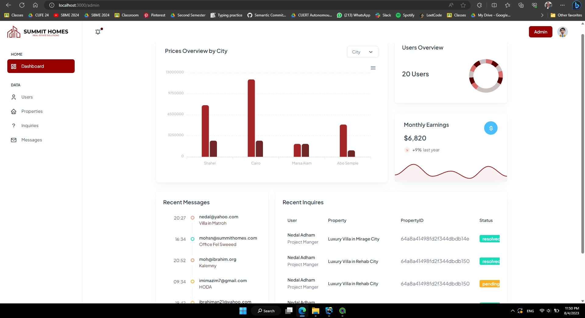
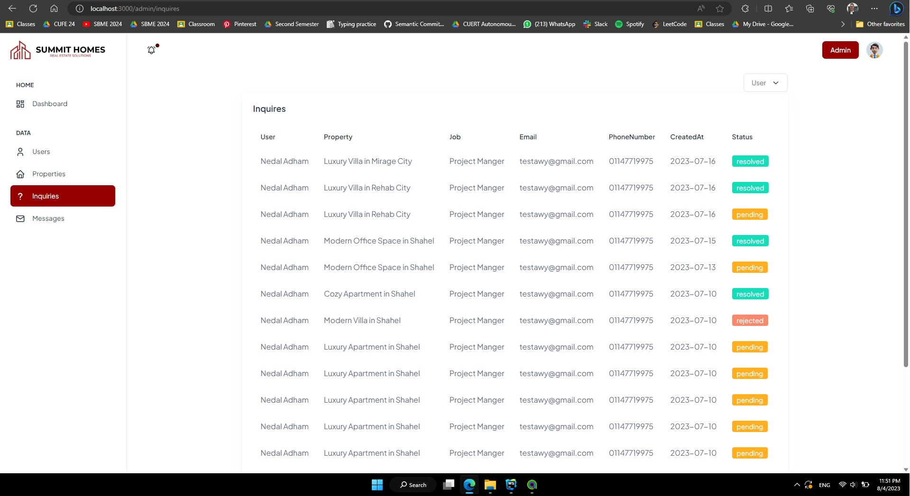
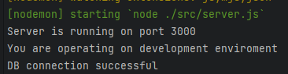

# Real-Estate-GP-Website (Summit Homes)




## Table of contents
- [Overview](#overview)
- [Features](#features)
- [Run the Project](#run-the-project)
- [Backend](#backend)
- [Frontend](#frontend)


## Overview
This is a Real Estate Web Application built with NodeJS, Express &amp; MongoDB following MVC Architecture for a friend Graduation Project


## Features
- User Authentication (Login, Register, Logout)
- User Authorization (Admin, User)
- Admin Dashboard (CRUD Operations)
- User Dashboard (CRUD Operations)
- Search for Properties
- Filter Properties
- Sort Properties
- Pagination
- Contact Us
- Inquiries

### Examples

#### Home Page


#### Properties Page


#### Contact Us Page


#### User Data Page


#### Admin Dashboard


#### Inquiries Page



## Run the Project

### Pre-requisites
Make sure you have installed all the following prerequisites on your development machine:
- NodeJS
- MongoDB
- MongoDB Compass (Optional)
- MongoAtlas (Optional)
- Postman (Optional)

### Run the server
- Clone the repo
```bash
git clone [repo]
```
- Open the terminal in the project directory
```bash
cd Real-Estate-GP-Website/server
```
- Run `npm install` to install all the dependencies
- Run `npm start` to start the server
- Open your browser and go to `http://localhost:3000/`
- Enjoy!

Make sure to be connected to the internet to be able to connect to the database



### Backend
The backend is built with NodeJS, Express & MongoDB following MVC Architecture which is a software design pattern for developing web applications.
A Model View Controller pattern is made up of the following three parts:
- Model: Responsible for managing the data of the application. It responds to the request from the view and to the instructions from the controller to update itself.
- View: A presentation of data in a particular format, triggered by the controller's decision to present the data. They are script-based template systems such as JSP, ASP, PHP and very easy to integrate with AJAX technology.
- Controller: The controller responds to the user input and performs interactions on the data model objects. The controller receives the input, it validates the input and then performs the business operation that modifies the state of the data model.


You can refer to the backend API documentation [here](https://documenter.getpostman.com/view/21802740/2s9XxyQtJw) 
You will find a complete documentation of all the endpoints with examples and responses using Postman

### Frontend
The frontend is built with HTML, CSS, JavaScript, Bootstrap & EJS (Embedded JavaScript templating) which is a simple templating language that lets you generate HTML markup with plain JavaScript.
The application uses EJS to render the views and send them to the client. The views are located in the `views` folder. 
hence server-side rendering is used in the user side of the application. but the admin side is built using client-side rendering.


